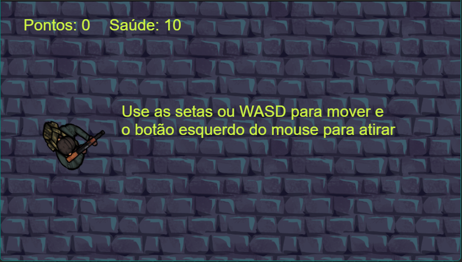
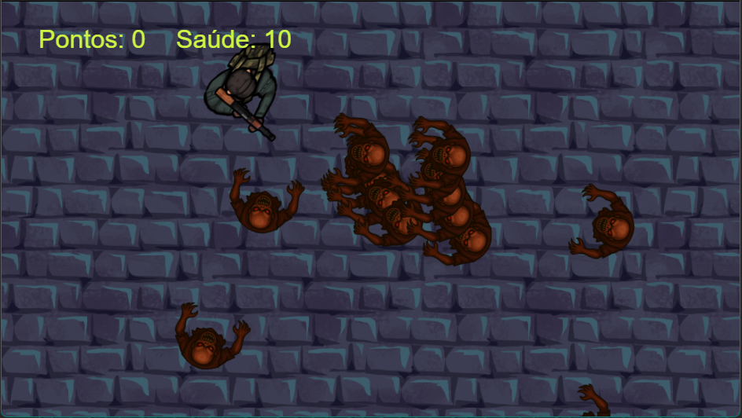
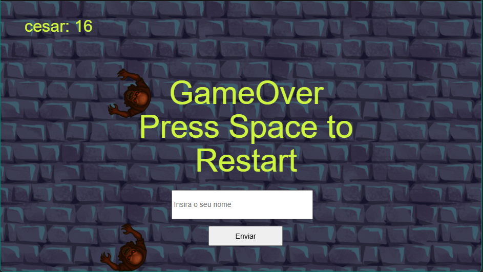
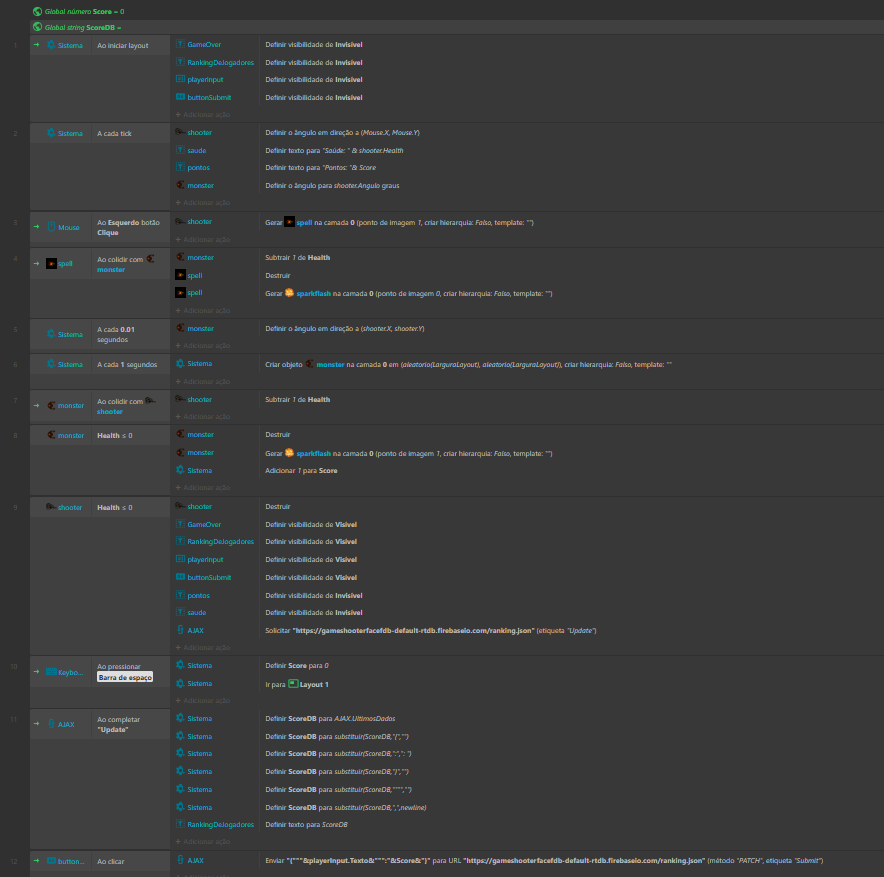
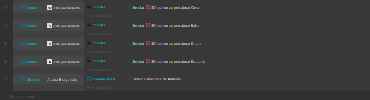
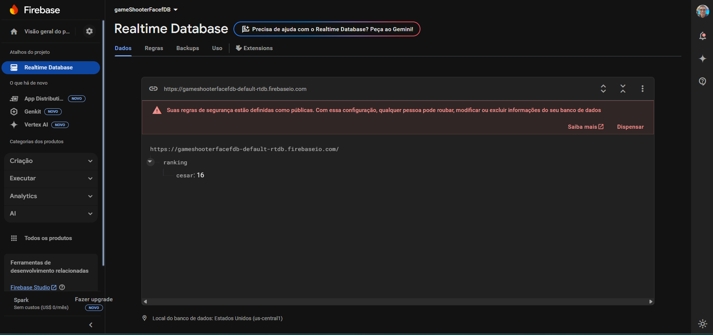

# 🔫 Top-Down Shooter - Construct 3

Um jogo 2D estilo *top-down shooter* desenvolvido no **Construct 3**, onde você controla um personagem com uma arma enfrentando ondas de monstros que te seguem pelo mapa. 
Feito com arte personalizada e controles otimizados para teclado.

## 🎮 Gameplay

- Controle o personagem com **WASD**
- Controle o personagem com setas direcionais
- Mire com o **mouse**
- Atire com o **clique esquerdo**
- Derrote inimigos que surgem com inteligência básica para pontuar
- O jogo te permite reiniciar quando o jogador morre
- O jogo te permite salvar sua pontuação junto do seu nome

## 🛠️ Tecnologias

- [Construct 3](https://www.construct.net/)
- Arte em pixel/top-down estilo cartoon
- Eventos com lógica própria
- Sprites personalizados gerados com auxílio de IA

## 🎨 Arte

- Personagem: Soldado em vista superior (top-down)
- Inimigos: Criaturas monstruosas em vista superior (top-down)
- Efeitos: Balas e explosões
- Todos os sprites foram personalizados para manter consistência visual

## 🎯 Controles

| Tecla | Ação              |
|-------|-------------------|
| W     | Mover para cima   |
| A     | Mover para esquerda |
| S     | Mover para baixo  |
| D     | Mover para direita |

| Tecla | Ação              |
|-------|-------------------|
| ⬆     | Mover para cima   |
| ⬅    | Mover para esquerda |
| ⬇     | Mover para baixo  |
| ⮕    | Mover para direita |

| Tecla | Ação              |
|-------|-------------------|
| Mouse | Mira e atira      |
| Clique esquerdo | Disparo |

## 🧪 Funcionalidades

- Sistema de movimentação baseado em **WASD + Mouse OU Setas + Mouse**
- Sprites no estilo **top-down shooter**
- Suporte a colisões e detecção de vida

## 📦 Como jogar

1. Abra o projeto no [Construct 3](https://editor.construct.net/)
2. Clique em **Run Layout** (F5)
3. Divirta-se eliminando os inimigos!

## Imagens

*Início do Game*

*Durante o Game*

*GameOver*

*Planilha de Eventos*

*Banco de Dados*

